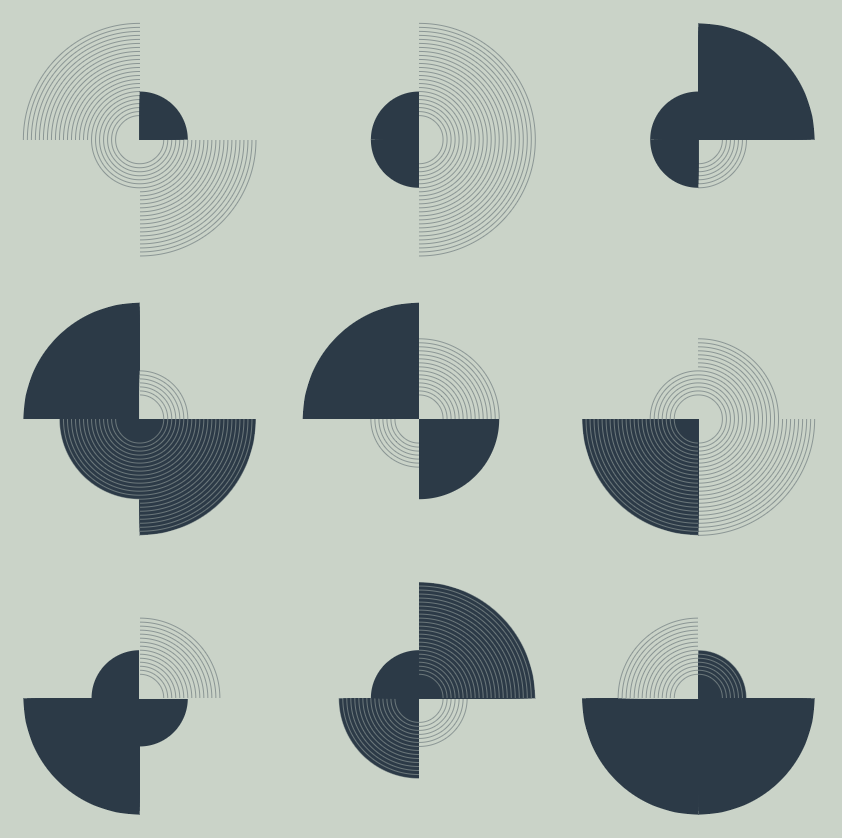

# p5js-grid-layout

Helper functions to lay out shapes in a centred auto-adjusting grid in p5js

includes a demo sketch



## function: drawOnGridWithMouseResizing

same signature as `drawOnGrid()`, however, mouse x, y movement will adjust the grid (padding and zoom).

## function: drawOnGrid

Draw shapes on a grid, automatically adjusting grid layout to centre and maximise space

### parameters:

- `shapeFn`: callback (takes no params) to draw a shape at 0, 0, with a size as promised by `originalSizeAsScreenFraction`
- `paddingAsShapeFraction`: desired distance BETWEEN TWO instances, as fraction of shape's size. This is NOT the padding each ONE receives on ONE edge, but DOUBLE that.
- `originalSizeAsScreenFraction`: Fraction of the smaller canvas dimension which the shape will occupy if left unscaled.

### Example usage

```
function draw(){
    drawOnGrid(drawMyShape, 0.7, 0.1);
}

```

Where `drawMyShape` is a provided callback function that will draw
at the current origin (0,0).

E.g.:

```
function drawMyShape(){
    const smallerDimension = min(width, height);
    const shapeSize = smallerDimension * 0.7;
    noStroke();
    fill('orange');
    circle(0, 0, shapeSize);
    fill(30);
    circle(0, 0, shapeSize * 0.5);
}
```

Note that it draws a shape of diameter 70% of the current smaller of the two screen dimensions. In drawOnGrid, we pass 0.7 to reflect this original 70% size.
